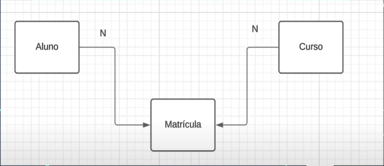
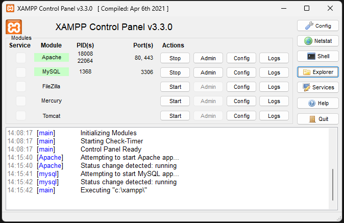

### Fluxo que iremos utilizar neste projeto:

- Relacionamento de N para N
- Serão 3 tabelas, uma para matricula, alunos e cursos. A matricula será a entidade fraca;
- Aluno se matricula em cursos e cursos é matriculado por aluno;

### Ferramentas utilizadas para o desenvolvimento:

- Xampp: Apache e MySQL
- Visual Studio Code

